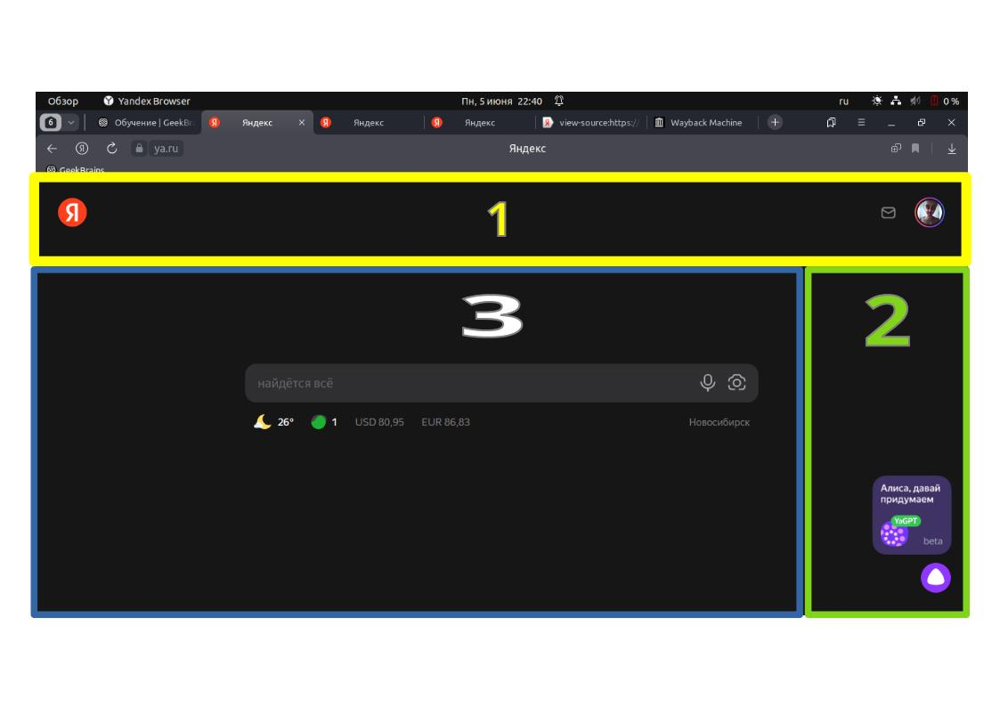
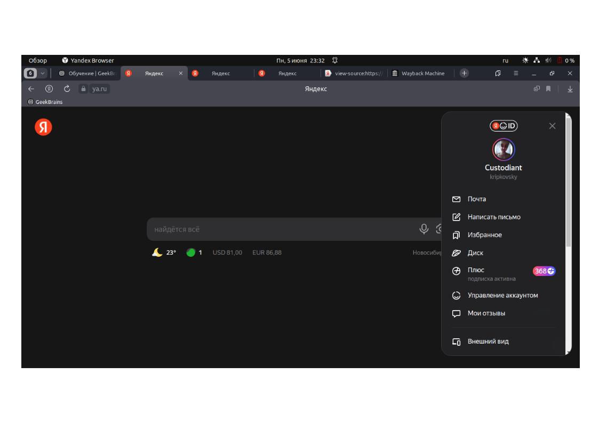
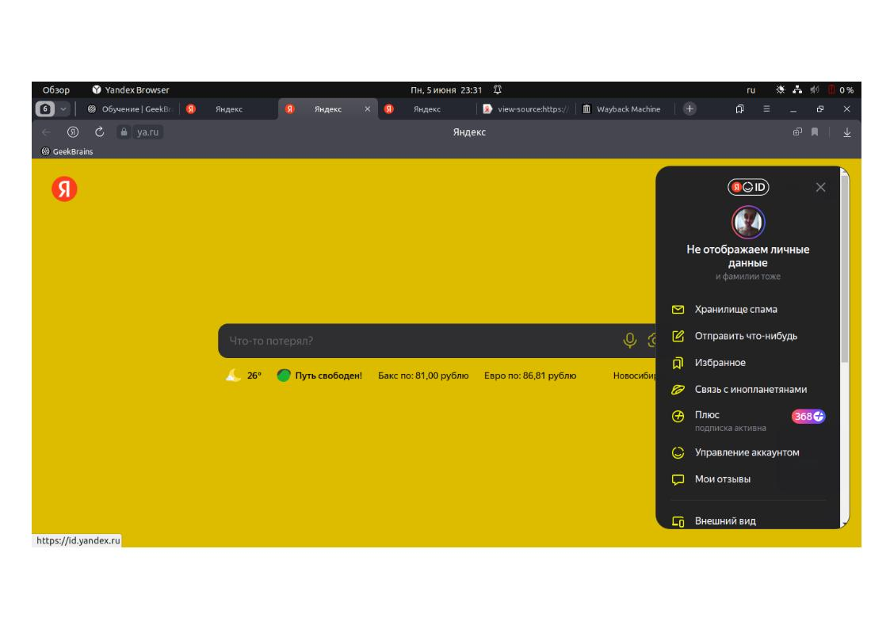
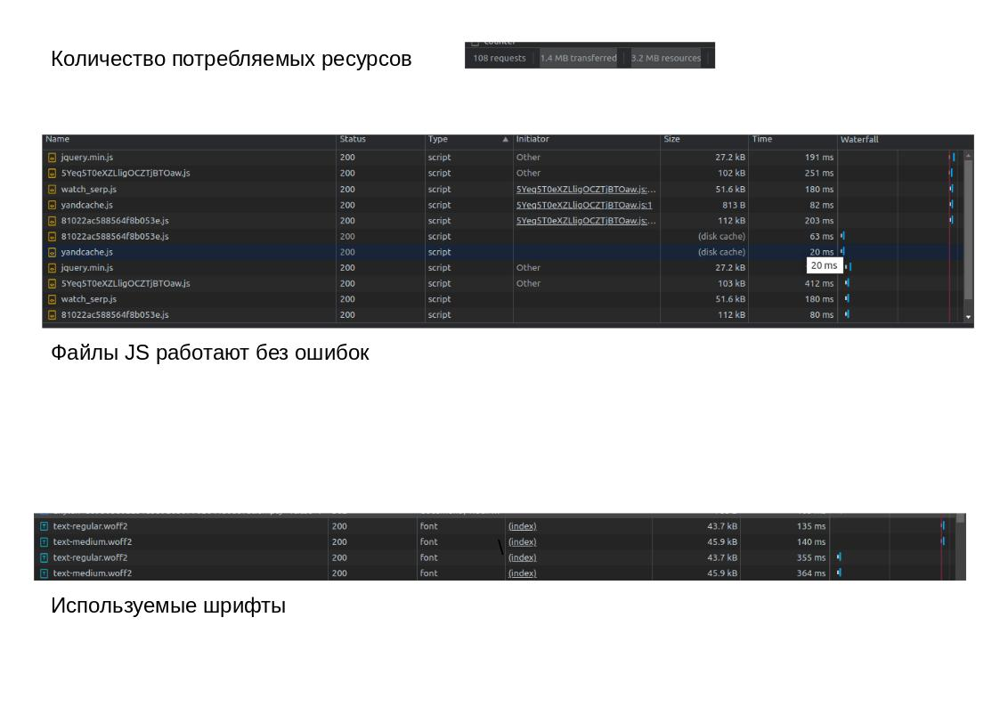

Задача: на основе сайта yandex.ru:
- **Определите, на каком протоколе работает сайт.**
* ссылка на "yandex.ru", переводит на сайт "Дзен". Так как в презентации на видео указывали ресурс яндекса, буду рассматривать на примере главной страницы "ya.ru" - (https://ya.ru)
* Сайт работает на безопасном протоколе https, прошедшем SSL сертификацию

**Проанализируйте структуру страницы сайта.**

* 1 Header (шапка), присутсвует, в левом углу вовзврат на глаынй экран, в правом переход на почтовый сервис, и раскрывающееся окно аккаунта
* 3 content (контентная часть), Состоит из поискового меню, текущей геопозиции, температуры и обстановке на дорогах, а также курс валют. Доллар и евро
* 2 sidebar (зона виджетов), реализован запрос к нейросети, и общение с голосовым помошником
* footer (подвал), на главном слайде отсутсвует, его можно найти в раскрывающемся окне аккаунта

**Внесите не менее 10 изменений на страницу с помощью инструмента разработчика и представьте скриншоты было/стало.**

* 

* 

* Изменены текста на главном экране и всплывающем, изменен главный фон и дополнительного меню, изменен цвет иконок и текста

**Задание по желанию необязательное - Создайте прототип низкой детализации (дополнительное задание, если на семинаре дошли до задания №8).**

